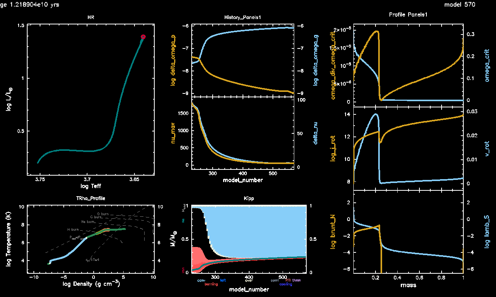
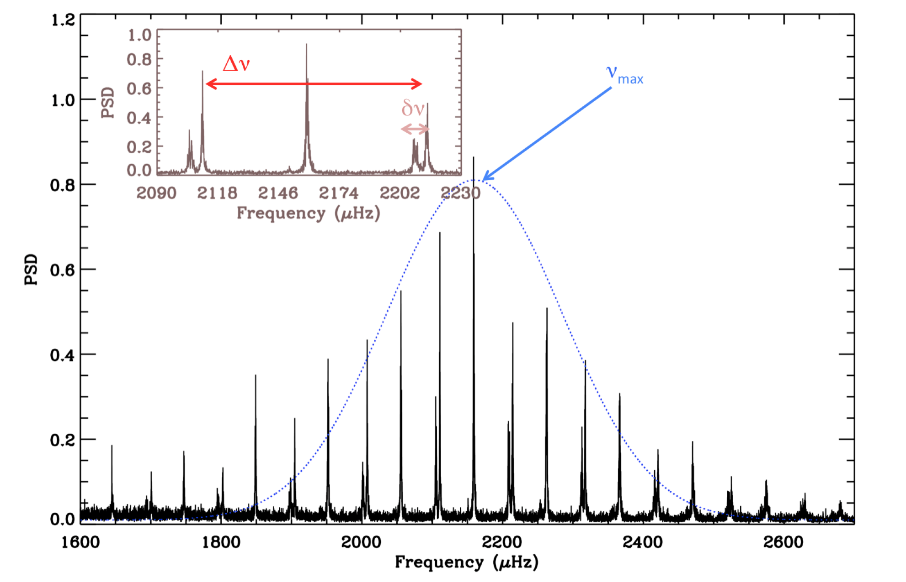
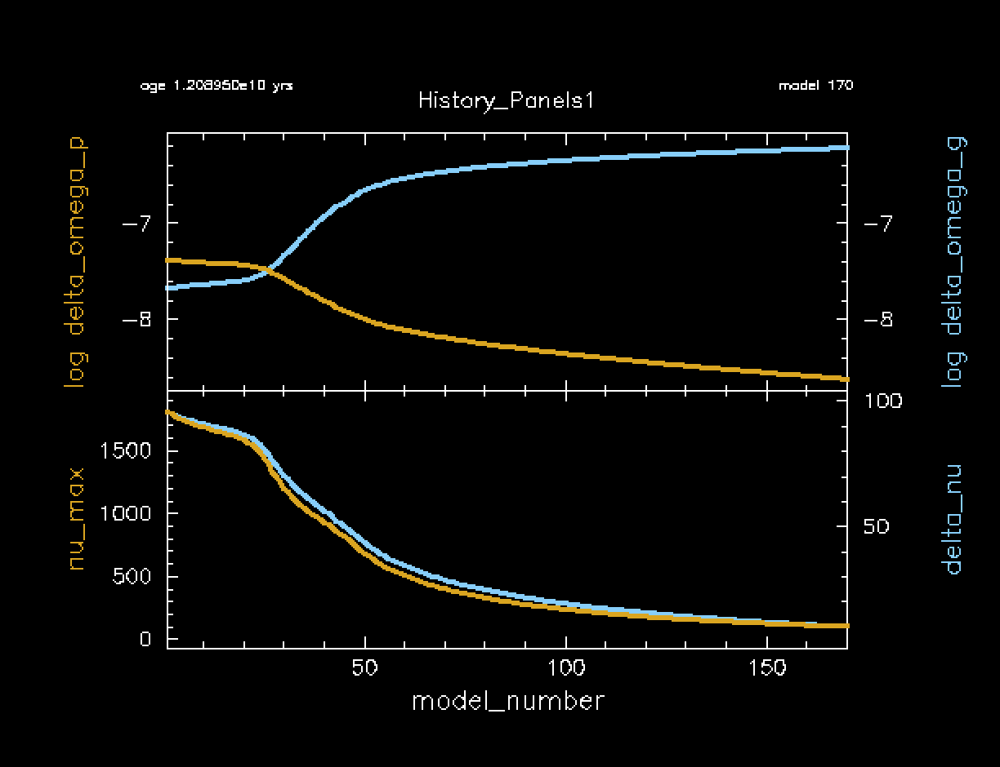
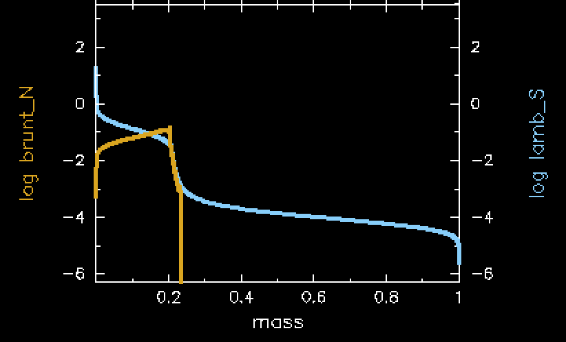

# Lab 1: Installing and using GYRE

## Learning Goals

- Install GYRE
- Calculate a 1 Msun rotating MESA model for use with GYRE
- Calculate the JWKB estimators for rotation seen by g-modes and p-modes

---

`MESA` is distributed with two codes for stellar oscillations:

- [`GYRE`](https://gyre.readthedocs.io/en/stable/), by R. H. D. Townsend, and
- [`ADIPLS`](https://ui.adsabs.harvard.edu/abs/2008Ap%26SS.316..113C/abstract), by J. Christensen-Dalsgaard.

The calculations performed by the two are essentially equivalent, with the main tradeoff being between performance and ease of use. In this tutorial, we will restrict our attention to `GYRE`, which is much easier to get started with.

## Installing GYRE

GYRE comes automatically packed in with your MESA installation. For MESA version 24.08.1, the shipped GYRE version is 7.2.1. However, GYRE has since updated to version 8.0. Be sure that you are viewing the docs for the correct version number of the GYRE version that you are using. For GYRE 7.2.1, the link to the documentation is [here](https://gyre.readthedocs.io/en/v7.2.1/index.html).

See the screenshot below to check for the correct GYRE version when viewing the docs. If you see "latest" or "stable" here, that indicates you are viewing version 8.0 (for now, until a new update comes out).


The [GYRE Docs](https://gyre.readthedocs.io/en/v7.2.1/ref-guide/installation.html) contains a tutorial for GYRE installation. However, since we are not installing GYRE from a tar file, we will slightly modify what is written in this guide. The instructions are copied below with explicit changes listed.

### Extracting GYRE
We will not need to extract the GYRE source code from a tar file, as it is already extracted. 

### Set Environment Variables
Secondly, we will set the environment variable `$GYRE_DIR` equal to the following:
```export GYRE_DIR=$MESA_DIR/gyre/gyre```

Remember that this is best placed inside your shell's RC file in your home directory (usually `.bashrc` or equivalent), similarly to when you first installed MESA. **Don't forget to `source` this file to apply the changes to your terminal window!**

### Compile
Now, we can follow the GYRE installation guide from this point. Go ahead and compile:

```make -j -C $GYRE_DIR install```

### Test
Once that's complete, it's good practice to run the test suite to ensure nothing has gone wrong during the installation process:

```make -C $GYRE_DIR test```

|ℹ️ INFO |
|:--|
| If all the tests read "...succeeded" then you are good to move on to the next step. If that's not the case, ask your TA or a developer for help. |

---

## Create a rotating red giant star model

In today's labs, we will be studying the oscillation frequencies of red giant stars and how those oscillations are affected by rotation. So, to start, we will need to generate a model of a red giant star that is rotating. 

### 1: Download our template from Github

First, extract all of the files from [the template](lab1_template.zip) into a new working directory for your rotating star model. Call it whatever you like. Your working directory should have the following files in it.

```
>> tree .
.
├── ck
├── clean
├── history_columns.list
├── inlist
├── inlist_1M_star
├── inlist_pgstar
├── make
│   └── makefile
├── mk
├── profile_columns.list
├── re
├── rn
├── src
│   ├── run_star_extras.f90
│   └── run.f90
└── tams.mod

3 directories, 14 files
```

### 2: Update the template files

The files you've downloaded will be a template version of the files you need to run this lab. First we will need to add a few lines to the inlist that runs the star (`inlist_1M_star`). 

#### `&star_job`

Notice that we are starting from a $M_\odot$ TAMS model called `tams.mod`. That TAMS model is non-rotating, but this isn't an issue for our rotating model. We initialize the rotation at TAMS in order to save time in the simulation. In your science, you should initialize rotation in a place that makes sense for the problem you are working on. For our purposes, this will be fine as we only care about rotation on the RGB phase.

We will initialize rotation in the `&star_job` portion of the inlist. There are many options in MESA for this ([see docs here for an example](https://docs.mesastar.org/en/latest/reference/star_job.html#new-rotation-flag)). We will initialize our rotation as a solid body by setting an initial $\Omega/\Omega_{crit}$ which will be constant across the star.

For today's set of labs, you will be assigned a rotation rate based on your table. These are all available in [our google sheet](https://docs.google.com/spreadsheets/d/1pAcvlfqOga0JNZo3cjJeZaErVd4youLYHyAmAu3NmSE/edit?usp=sharing) for this lab. You will upload information from these labs to this sheet throughout the day. At each table, there will be four different `nu_max` values to choose from. We will use this value of `nu_max` as a proxy for the age of your rotating RGB star in this lab and the later ones. For now, decide in your group who will choose each value of `nu_max` and claim your model directly in the google sheet. In lab 2 and 3, the lower `nu_max` values will take slightly longer than others to run, so choose according to your computing speed if you need to.

|📋 TASK |
|:--|
| 1. Pick a rotation rate and nu_max value from [the google sheet](https://docs.google.com/spreadsheets/d/1pAcvlfqOga0JNZo3cjJeZaErVd4youLYHyAmAu3NmSE/edit?usp=sharing) (nu_max will be used later on in the labs.) |
| 2. Add the following lines to the `star_job` portion of `inlist_1M_star` |

```fortran
    new_rotation_flag = .true.
    change_rotation_flag = .true.
    change_initial_rotation_flag = .true.
    new_omega_div_omega_crit = ### ! INSERT YOUR ROTATION RATE HERE
    set_initial_omega_div_omega_crit = .true.
    set_omega_div_omega_crit = .true.
```

|ℹ️ INFO |
|:--|
| In this lab, we have turned on rotation, but we have **NOT** turned on the flags corresponding to rotationally induced mixing or angular momentum transport. In your own science cases, you will need to make a choice about how you implement these two things. |


#### controls

The only thing we'll need to update in `&controls` is to ensure that MESA outputs the type of files needed for GYRE. These are usually referred to as `pulse_data` in the MESA docs.

|📋 TASK |
|:--|
| 1. Add the following lines to the `&controls` portion of `inlist_1M_star` |

```fortran
   write_pulse_data_with_profile = .true.
   add_atmosphere_to_pulse_data = .true.
   keep_surface_point_for_pulse_data = .true.
   add_double_points_to_pulse_data = .true. 
   pulse_data_format = 'GYRE'
```

While you don't need to change these, you should notice that we are running this model at low resolution (large `mesh_delta_coeff` and `time_delta_coeff`). Once again, you should choose this value to reflect your science question and convergence studies. We have chosen this value to prioritize running speed.

#### run_star_extras.f90

Since our star is rotating, we can calculate analytically the effect of rotation on the different types of oscillation modes (p-modes and g-modes) in the red giant star. These will be discussed further in Lab 3, but for now we should implement the calculation of them.

In the JWKB approximation, we have the following estimators for p-modes and g-modes, respectively:
$$\delta \Omega_p = \frac{\int_0^R \Omega(r){\mathrm d r \over c_s}}{\int_0^R \mathrm 1/c_s \mathrm d r}$$
$$\delta \Omega_g = 0.5 \frac{\int_{N^2>0} \Omega(r){N \over r}\mathrm d r}{\int_{N^2>0}\frac{N}{r} {\mathrm d r}}$$
Where $\Omega(r)$ indicates the rotation rate (`s% omega`), $N$ indicates the Brunt-Väisälä frequency (`s% brunt_N`) and $c_s$ indicates the sound speed (`s% csound`). These are, effectively, average values of of the rotation rate as sensed by p- and g-modes in a star.

We can easily add these estimators to the MESA output as a history file. We will outline the process below, since there are some fortran specifics you may not know, but feel free to go ahead and code up these equations now if you are confident in your fortran coding.

|📋 TASK |
|:--|
| 1. Edit the `how_many_extra_history_columns` section of your `src/run_star_extras.f90` file to tell it we are going to add two new columns. |



First, edit the function `how_many_extra_history_columns` to tell it we are going to add two new columns.

```fortran
      integer function how_many_extra_history_columns(id)
        integer, intent(in) :: id
        integer :: ierr
        type (star_info), pointer :: s
        ierr = 0
        call star_ptr(id, s, ierr)
        if (ierr /= 0) return
        how_many_extra_history_columns = 2 !! change this line
      end function how_many_extra_history_columns
```



##### delta_omega_p

Lets start with $\delta \Omega_p$. To calculate this term, we will need to integrate over the whole star. In order to do this, we have included a function in the template `src/run_star_extras.f90` file that is called `integrate_r_` which is lifted straight from the GYRE utility functions. Notice the first line of this function:

```fortran
      function integrate_r_(x, y, mask) result(int_y)
```

This indicates that we will need to input an array for x and y, and an optional argument called mask, and the function will return a number. Note that `int_` means integrated, not an integer. In our case, x will be the array describing the radius of the star, which you can retrieve from the star pointer. The y array will be the integrand portion of the equations given above. For $\delta \Omega_p$ you will not need a mask, so the third argument can be omitted.

You can call the function `integrate_r_` from within any subroutine without needing any extra declarations.

|📋 TASK |
|:--|
| 2. Edit your `src/run_star_extras.f90` file to add the above JWKB estimator for $\delta\Omega_p$ as a history column. Call this column `delta_omega_p`. |



Remember you will need to allocate memory to any variables (i.e. declare your variables and their type) at the top of the `data_for_extra_history_columns` subroutine.





Remember you can call these terms from the star pointer with `s% r` for the radius, `s% omega` for omega, and `s% csound` for the sound speed.





When you pass arrays to the `integrate_r_` fortran function, you will need to specify the entire array should be passed. This can be done by first declaring an integer variable (`integer :: nz`) for the number of zones, then defining it from the star pointer (`nz = s% nz`), and then passing it to the integration function as e.g. `integrate_r_(s% r(1:nz), ...`





Within `data_for_extra_history_columns`:

```fortran
      subroutine data_for_extra_history_columns(id, n, names, vals, ierr)
        integer, intent(in) :: id, n
        character (len=maxlen_history_column_name) :: names(n)
        real(dp) :: vals(n)
        integer, intent(out) :: ierr
        type (star_info), pointer :: s

        integer :: nz

        ierr = 0
        call star_ptr(id, s, ierr)
        if (ierr /= 0) return

        nz = s% nz

        names(1) = 'delta_omega_p'
        vals(1) = integrate_r_(s% r(1:nz), s% omega(1:nz)/(s% csound(1:nz))) / integrate_r_(s% r(1:nz), 1/(s% csound(1:nz)))
        
        !! We will add delta_omega_g here in a moment

      end subroutine data_for_extra_history_columns
```



##### delta_omega_g

Now lets implement $\delta \Omega_g$. To calculate this term, we will need to integrate over only a specific region of the star where the Brunt-Väisälä frequency is positive ($N^2$>0). To do this we will need to pass a mask to the `integrate_r_` function that we're using. However, we don't know initially what size this mask array will be, and therefore how much memory it will need, so we need to define it in the subroutine as something called an "allocatable". This can be done at the beginning of the `data_for_extra_history_columns` subroutine using:

```fortran
logical, allocatable :: mask(:)
```


In our case, mask arrays are a type of array filled with booleans (`True`s and `False`s) that one can use to "slice" specific indices of an array. For example, if your mask array was [True,False,True,False], then you could use this mask to select the 1st and 3rd element of another array with a length of 4.



Since MESA doesn't use a static number of zones across the evolution of a model, the total size of this array will change at different timesteps.


Now, before we define $\delta \Omega_g$ directly, we will need to start by allocating and deallocating memory to this mask array that we just made. We will instruct it to make the array a length equivalent to the number of zones in the model. Add the following lines to the `data_for_extra_history_columns` subroutine:

```fortran
        allocate(mask(nz)) ! Double check that you have defined nz = s% nz somewhere

        ! we will work here in a moment

        deallocate(mask)
```

Now we can define the elements of the mask array itself using a logical expression. Recall we will need the region where $N^2 > 0$ (remember $N^2$ is `s% brunt_N2`). However, for subtle reasons we will also need to avoid a small region of the surface, using the logical expression $q < 0.95$ where q is the mass coordinate of the star. Define the mask using the following line :

```fortran
mask = (s% brunt_N2(1:nz) > 1d-10) .and. (s% q(1:nz) < .95d0)
```


As you'll see near the end of the lab when you look at something called a propagation diagram, there is a small region on the surface of red giant stars where the Brunt-Väisälä frequency increases again. However, this region is not really part of the g-mode cavity in nature (which is what we're really isolating with $N^2>0$), so we avoid it directly here by avoiding the outer 5 percent of the star's mass (the surface).



Not necessarily. 
<!--, given how it is defined. One can show that these two definitions for the Brunt-Väisälä frequency are equivalent:
$$N^2 = g \left({1 \over \Gamma_1 P}{\mathrm d P \over d r} - {1 \over \rho} {\mathrm d \rho \over \mathrm d r}\right) = -{g \delta \over H_P}\left(\nabla - \nabla_\mathrm{ad} - {\varphi \over \delta}\nabla_\mu\right).$$
Here $g$ is the surface gravity, $H_P = |{\mathrm d \log P} / {\mathrm d r}|^{-1}$ is the pressure scale height, and $\delta = {\partial \log \rho / \partial \log T}|_{P,\mu}$ and $\phi = {\partial \log \rho / \partial \log \mu}|_{P,T}$ are constants associated with the equation of state; for an ideal gas, they are both 1. By inspection, the term in the parentheses in the second definition is the Ledoux discriminant: that is, it is -->
Roughly speaking, as a matter of definition, $N^2$ is proportional to the Ledoux discriminant: i.e. the quantity whose sign is used in the Ledoux criterion for deciding where convection is occurring in the star. As such, $N^2$ is positive only in parts of the star that are radiatively stratified (i.e. where convection isn't happening), allowing $N$ to be treated as an oscillation frequency. There, it is the natural frequency of buoyancy oscillations --- the same kind as you would see in a cork bobbing up and down on the surface of a pond!

Suppose now we were to describe such oscillations locally with a complex phasor, $A e^{\pm i N t}$. What happens when $N$ is purely imaginary (as it would be in convection zones, where $N^2$ is negative)? This oscillatory behaviour becomes exponential divergence or decay, with a characteristic timescale $\tau_\text{conv} = 1/\sqrt{|N^2|}$. This is, in fact, how MESA internally defines the convective timescale.


Now with this mask defined, you should have all the pieces you need in order to code up the JWKB estimator for $\delta \Omega_g$. Note that for $N$ you will need to take the square root of `brunt_N2`.


The short answer is yes, but that's only because we've already masked out the $N^2 > 0$ region. `brunt_N` in MESA is defined as `sqrt(abs(brunt_N2))`, so it would give you an incorrect value of $N$ in regions where $N^2 < 0$.


|📋 TASK |
|:--|
| 2. Edit your `src/run_star_extras.f90` file to add the above JWKB estimator for $\delta\Omega_g$ as a history column. Call this column `delta_omega_g`. |



Is your mask allocation and deallocation in the proper order around using the variables? Allocation should occur before defining the mask and deallocation should occur after the history column has been saved.





Within `data_for_extra_history_columns`:

```fortran
      subroutine data_for_extra_history_columns(id, n, names, vals, ierr)
        integer, intent(in) :: id, n
        character (len=maxlen_history_column_name) :: names(n)
        real(dp) :: vals(n)
        integer, intent(out) :: ierr
        type (star_info), pointer :: s

        integer :: nz
        logical, allocatable :: mask(:)

        ierr = 0
        call star_ptr(id, s, ierr)
        if (ierr /= 0) return

        nz = s% nz

        names(1) = 'delta_omega_p'
        vals(1) = integrate_r_(s% r(1:nz), s% omega(1:nz)/(s% csound(1:nz))) / integrate_r_(s% r(1:nz), 1/(s% csound(1:nz)))
        
        allocate(mask(nz))

        mask = (s% brunt_N2(1:nz) > 1d-10) .and. (s% q(1:nz) < .95d0)

        names(2) = 'delta_omega_g'
        vals(2) = 0.5d0 * integrate_r_(s% r(1:nz), s% omega(1:nz) * sqrt(s% brunt_N2(1:nz))/(s% r(1:nz)), mask=mask) &
             / integrate_r_(s% r(1:nz), sqrt(s% brunt_N2(1:nz))/(s% r(1:nz)), mask=mask)

        deallocate(mask)

      end subroutine data_for_extra_history_columns
```



|ℹ️ INFO |
|:--|
| A quick `./clean` and `./mk` after editing your `src/run_star_extras.f90` file will tell you if your fortran code has any obvious bugs or not. |
| Also its required!! So always `./clean` and `./mk`!!!! |

## Run the star

Now go ahead and `./clean`, `./mk`, and `./rn` your model. While it's running, you will see pgstar output, which will be explained below. Your run should take roughly 5 minutes to finish.

### What plots you are seeing

By this point, you should be familiar with the HR diagram (top left), T-Rho Profile (bottom left), and Kippenhahn diagrams (bottom middle). The other panels will show you some important history and profile values within your model.

In the top middle panel you'll see the JWKB estimators (on logarithmic scale) that you included into your history columns above.

In the centermost panel, you'll see the asteroseismic values $\nu_{\rm max}$ (`nu_max`) and $\Delta\nu$ (`delta_nu`). These values are explained below.

In the top 2 panels on the right hand side, you'll see values pertaining to the rotational profile of the star, including the rotation rate $\Omega/\Omega_\text{crit}$ (`omega_div_omega_crit`), the critical rotation rate $\Omega_\text{crit}$ (`omega_crit`), the angular momentum (`log_j_rot`), and the linear rotational velocity (`v_rot`). 

In the bottom right you'll see the Brunt-Väisälä frequency (`brunt_N`) and the Lamb frequency (`lamb_S`). These are used to visualize a mode propagation diagram, which will be somewhat explained below, but you will also calculate your own in Lab 2.

### At the end

Near the end of the red giant evolution, your pgstar output should look something like this. Notice the difference between the core and envelope rotation rates, as well as the sharp difference in the angular momentum at the core boundary. 



#### $\nu_\mathrm{max}$ and $\Delta\nu$

In solar-like oscillators, such as the red giant we are modelling here, the oscillations excited in the star form a specific pattern, as shown below (reproduced from [Garcia 2015](https://ui.adsabs.harvard.edu/abs/2015EAS....73..193G/abstract)).



This figure also labels two important global asteroseismic parameters. First is $\nu_{\rm max}$ which is roughly the central frequency of the excited oscillations, as denoted in the above figure as the mean of the blue dotted Gaussian curve. The second is $\Delta\nu$ or the large frequency separation, which is the frequency difference between successive radial modes (with increasing radial order $n$). This is denoted by the red solid arrow. This should not be confused with the small frequency separation $\delta\nu$, denoted by a small pink arrow.

These two parameters are incredibly fundamental to solar-like asteroseismology, and can be calculated by MESA. These two parameters (`nu_max` and `delta_nu`) are plotted in the History Panels output of your rotating red giant model, as shown below. Notice how they are highly correlated to each other. In other words, they both decrease at roughly the same rate. Also notice that they both decrease as the star's radius expands. Remember that bigger objects oscillate at lower frequencies, just like in instruments (tubas are much lower frequency than flutes, for example).

You will become more acquainted with $\nu_{\rm max}$ and $\Delta\nu$ as you move through the labs, so don't get discouraged if you aren't understanding the full picture of red giant oscillations just yet!



#### The Mode Propagation Diagram

Stellar oscillations propagate in regions that are unstable to the stellar wave equations, which are approximated by a simple harmonic oscillator. These regions of the star are bounded by two characteristic frequencies: the Brunt-Väisälä frequency ($N$) and the Lamb frequency ($S_\ell$). These two frequencies are both functions of radius `r` in your stellar model.

Oscillations with frequencies smaller than both `N` and `S` in your stellar model are called g-modes and they can propagate in the g-mode cavity. Alternatively, oscillations with frequencies larger than both `N` and `S` in your stellar model are called p-modes and they propagate in the p-mode cavity. 

In the pgstar output, you will see a line that corresponds to `brunt_N`. This indicates the Brunt-Väisälä frequency, as a function of mass coordinate within your star. Similarly, you will see a line indicating the Lamb frequency `lamb_S`. Specifically, this is the Lamb frequency for $\ell=1$, where $\ell$ is the spherical degree in the spherical harmonics equations.

You will generate another representation of this mode propagation diagram in Lab 2, which will give you another opportunity to understand where the mode cavities in this star exist and how they can couple to each other.



## After the run is finished - Final Task

After your run is completed, open up your history file and find the model closest to the `nu_max` value that you chose from [the google sheet](https://docs.google.com/spreadsheets/d/1pAcvlfqOga0JNZo3cjJeZaErVd4youLYHyAmAu3NmSE/edit?usp=sharing). Fill out the first five columns for your model (surface rotation rate `surf_avg_omega_div_omega_crit`, core rotation rate `he_core_omega_div_omega_crit`, delta_nu, delta_omega_p, and delta_omega_g) at the value of `nu_max` that you chose. Remember we're using `nu_max` here as a proxy for the age of the RGB, as `nu_max` will decrease as the RGB star expands over time.

|📋 TASK |
|:--|
| Fill out the first five columns of [the google sheet](https://docs.google.com/spreadsheets/d/1pAcvlfqOga0JNZo3cjJeZaErVd4youLYHyAmAu3NmSE/edit?usp=sharing) for your chosen model. |

|❓ QUESTION |
|:--|
| As everyone finishes running their models and inputting their values, what do you notice about the values you've input into the google sheet? Compare both to the different `nu_max` values but also to the different initial rotation rates. |


You should notice at least these things: 1) The `delta_nu` of each model should decrease with decreasing `nu_max`. 2) The surface rotation rates should decrease as `nu_max` decreases (age increases, radius increases). 3) The core and surface rotation rates should be different from each other.


## Optional Bonus: Output GYRE files at a specific numax

For Lab 2, you will be asked to calculate rotation frequencies at specific $\nu_{\rm max}$ (`nu_max`) values. To make this easier, you may choose to do a bonus exercise where you configure the `run_star_extras.f90` file to output both profile and GYRE files when the model is at a specific $\nu_{\rm max}$. **This is not required.** You can just as easily use your history file to find your calculated model closest to your desired $\nu_{\rm max}$.

|📋 OPTIONAL BONUS TASK |
|:--|
| 1. Edit your `src/run_star_extras.f90` file to only output profiles (and GYRE files) whenever $\nu_{\rm max}$ is at a specific, user input value. |



You will need to edit both the `&controls` section of `inlist_1M_star` and `extras_finish_step` in  `src/run_star_extras.f90`.





Some controls parameters that might be helpful to you are `write_profiles_flag` (and its corresponding value in `star_info`), as well as `s% need_to_save_profiles_now`.





Counterintuitively, you will need to change your profile_interval to 1.

This is because the `profile_interval` will still matter even if you tell MESA to output a file in run_star_extras. So, for example if the profile closest to your $\nu_\text{max}$ is model number 21, and your `profile_interval` is 5, then MESA will still skip the output of model number 21 regardless of what you tell it in `run_star_extras`.




In the `&controls` section of `inlist_1M_star`:

```fortran
   x_ctrl(1) = 100 ! USER INPUT VALUE OF NUMAX FOR CALCULATING
   write_profiles_flag = .false.
```

Also in the `&controls` section of `inlist_1M_star`:

```fortran
! OUTPUT PARAMS - ADJUST AS NEEDED
! NOTE YOU WILL NEED HISTORY OUTPUT AT PROFILE FOR BONUS TASK
   photo_interval = 1000
   profile_interval = 1 !!!! WAS 5 BEFORE
   history_interval = 1
   terminal_interval = 10
   write_header_frequency = 10
```

In `extras_finish_step` in  `src/run_star_extras.f90`:

```fortran
      integer function extras_finish_step(id)
        integer, intent(in) :: id
        integer :: ierr
        type (star_info), pointer :: s
        character(len=8) :: fmt, ind
        ierr = 0
        call star_ptr(id, s, ierr)
        if (ierr /= 0) return
        extras_finish_step = keep_going
                                                                                          

        if ((s% nu_max < (s% x_ctrl(1) + 2.5)) .and. (s% nu_max > (s% x_ctrl(1) - 2.5))) then
           s% write_profiles_flag = .true.
           s% need_to_save_profiles_now = .true.
           write(*,*) 'numax output now'
        else
           s% write_profiles_flag = .false.
        endif

        if (extras_finish_step == terminate) s% termination_code = t_extras_finish_step
      end function extras_finish_step
```

Note that this hard-codes a tolerance of 2.5 muHz to the numax that is output. You may find that this outputs more than one profile. If you find that it outputs no models, you may need to increase this tolerance.

As always there are many methods to doing this, so your code may not look exactly like this.



## Full Solutions

If you need them, a full lab 1 solution directory (including bonus task) can be found on our GitHub, [here](lab1_soln_dir.zip). You will still need to edit the rotation rate and the nu_max for output.

## Troubleshooting

### Input/output errors

On some systems (including HPC systems, but more generally on networked file systems), `GYRE` may **nondeterministically** fail to read or write files with i/o errors. Error messages may look like this:

```tex
HDF5-DIAG: Error detected in HDF5 (1.10.2) thread 0:
##000: ../../src/H5F.c line 445 in H5Fcreate(): unable to create file
major: File accessibilty
minor: Unable to open file
##001: ../../src/H5Fint.c line 1519 in H5F_open(): unable to lock the file
major: File accessibilty
minor: Unable to open file
##002: ../../src/H5FD.c line 1650 in H5FD_lock(): driver lock request failed
major: Virtual File Layer
minor: Can’t update object
##003: ../../src/H5FDsec2.c line 941 in H5FD_sec2_lock(): unable to lock file,
errno = 524, error message = 'Unknown error 524'
major: File accessibilty
minor: Bad file ID accessed
```

This is a known issue with the file locking feature as implemented in versions of the HDF5 library newer than 1.10.x (which `GYRE` uses for i/o operations) interacting with Linux filesystem drivers, particularly for networked drives, which may not properly implement file locking — see <https://web.archive.org/web/20240508120524/https://support.nesi.org.nz/hc/en-gb/articles/360000902955-NetCDF-HDF5-file-locking>. So far, Rich hasn't come up with a fix for this. We recommend working around it by setting the following environment variable:

```bash
export HDF5_USE_FILE_LOCKING=FALSE
```
