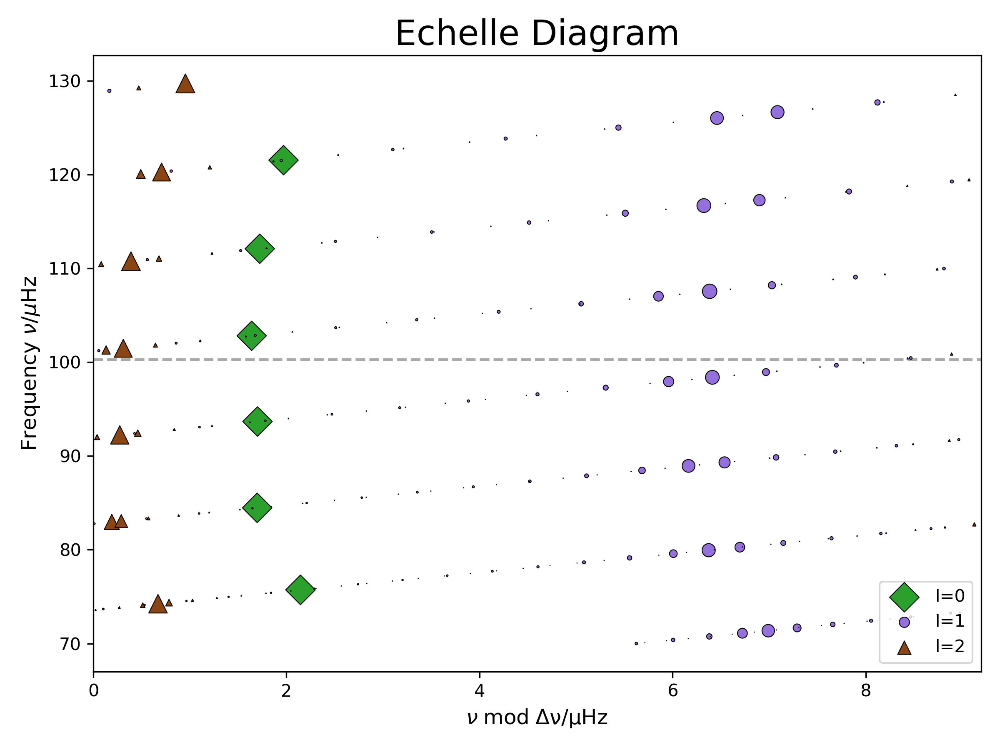

# Lab 2: Calculating Mode Frequencies

## Learning Goals

- Learn how to set up and run Gyre
- Visualize oscillations in an échelle diagram and study their eigenfunctions.

## Gyre namelist
Just like with MESA, GYRE takes an input file that we will call an "inlist". Again, just like MESA, these are plaintext files which are use the `namelist` format/functionality of Fortran. The GYRE inlist file is typically named something like `gyre.in`. For this lab we can and will start with an empty folder. 
|📋 TASK |
|:--|
| Go ahead and create an empty folder (e.g. `mkdir Lab2`) and 'cd' into it. Create a file called `gyre.in` in your favorite text editor, and paste the following lines into this file. Don't forget to add the empty line at the end!|

```fortran

&model
/
 
&constants
/
 
&mode
/
 
&osc
/
 
&num
/
 
&scan
/
 
&grid
/
 
&rot
/
 
&ad_output
/
 
&nad_output
/


```

As you can see, the inlist has sections which function similarly to how the inlist sections in MESA inlists work. However, in GYRE's case, there are many more types of inputs that we can use. References for each of these sections can be found [here](https://gyre.readthedocs.io/en/v7.2.1/ref-guide/input-files.html) in the GYRE docs.

So we need to fill out this inlist with the correct information. The following parts of this section will describe each namelist group starting from the top.

#### Model

Here's where we tell GYRE what type of model to read in and calculate frequencies for. [The docs](https://gyre.readthedocs.io/en/v7.2.1/ref-guide/input-files/model-params.html) have a full explanation of all the options.

We will add the following lines here:

```fortran
&model
    model_type = 'EVOL'
    file='PATH_TO_PROFILE/profile##.data.GYRE'
    file_format = 'MESA'
/
```

As described by the docs, this will tell GYRE that we are using an external evolutionary model, and that file is called `profile##.data.GYRE` and it's using MESA's default GYRE file format. 

|📋 TASK |
|:--|
| Choose a model from the [google sheet](https://docs.google.com/spreadsheets/d/1pAcvlfqOga0JNZo3cjJeZaErVd4youLYHyAmAu3NmSE/edit?usp=sharing) with the rotation rate you used in Lab 1 . Check the history.data file to find the appropriate profile number for the corresponding $\nu_{\rm max}$. It doesn't have to be the exact  $\nu_{\rm max}$ value. Discuss in you group who will run which model so you will have results for all of them. (The lower $\nu_{max}$ the longer the runtime)

#### Constants

 Here we can define various constants found [here](https://gyre.readthedocs.io/en/v7.2.1/ref-guide/input-files/constants.html). It is good practice to use identical values as used in the code generating your model. This group can be left empty for this lab as we are going to use the default values.

 <!-- #### Bonus
 Check how MESA defines its constants and how do they compare to gyres default values
```
 $GYRE_DIR/src/common/gyre_constants.fpp.
``` -->

 ### Mode
This namegroup defines which modes you want to calculate. You can state the angular degree ($l$) and the azimuthal order ($m$). For each type of mode we will need one extra `&mode` namegroup. For now we will leave the azimuthal order at its default value ($m=0$); it will come up later when we include rotation. We will also assign the modes with a tag to differentiate between them in other namegroups. For this lab using `'radial'` for the  $\ell=0$ modes and `'non-radial'` for all others is enough. 

|📋 TASK |
|:--|
| Add the instructions to calculate the `l=0`, `l=1` and `l=2` oscillation modes into your `gyre.in` file and give them the corresponding tag.|

<details>
<summary>ℹ️ SOLUTION </summary>

```fortran
&mode
    l=0
    tag = 'radial'
/

&mode
    l=1
    tag = 'non-radial'
/

&mode
    l=2
    tag = 'non-radial'
/
```
</details>

 ### Oscillation parameters

In this namegroup we can set various options on how to calculate the oscillations themselves. Which physics and assumptions to use, different boundary conditions, how to scale various parameters and so on. All of the options and their default values can be found [here](https://gyre.readthedocs.io/en/v7.2.1/ref-guide/input-files/osc-params.html).

|📋 TASK |
|:--|
| As per default GYRE assumes that at the outer boundary of the model, the stellar surface, the density vanishes. Instead we want to follow a more accurate description from Christensen-Dalsgaard (2008). Find and set the corresponding variable. To be consistent, you should also adjust `variables_set`.  |

<details>
<summary>ℹ️ HINT </summary>

Search for the `outer_bound` variable.

</details>

<details>
<summary>ℹ️ SOLUTION </summary>

```fortran
&osc
    outer_bound = 'JCD'
    variables_set = 'JCD'
/
```
</details>

#### Numerical Parameters
Here goes everything to do with numerical parameters. Again, we leave nearly everything at default (see [here](https://gyre.readthedocs.io/en/v7.2.1/ref-guide/input-files/num-params.html)) and only increase the difference scheme from a second-order to a fourth-order Gauss-Legendre collocation.

```fortran
&num
    diff_scheme = 'COLLOC_GL4'
/
```

#### Frequency Scan Parameters

This section tells GYRE in which frequency range it will scan for the oscillation eigenfunctions. The modes that are of interest to us are those closest to $\nu_{\rm max}$. We suggest to set `freq_min` and `freq_max` to $\nu_{\rm max} \pm 3 \Delta\nu$. Look into your `history.data` file to find the values of $\nu_{\rm max}$ and $\Delta\nu$ for your model with the profile you choose in the "Model" section. (We discussed those parameters in Lab1, if you need a refresher). We also set the units of our chosen range to μHz (`freq_units = 'UHZ'`) 

Next, we define the resolution, the number of points of our scan.  Generally, we need the grid spacing to be smaller than the eigenfrequency separation of adjacent modes, across the full range of the grid. There is no absolute rule as how to determine this value beforehand, but a too low value could miss some modes and a high value means a longer runtime. For our radial p-modes `n_freq = 200` is enough but because we calculate the oscillations also for red giants we do not only have p-modes but also mixed-modes (for the non-radial modes). These will need a higher value. To be more efficient we therefore define two different `&scan` namegroups. To define which modes correspond to which scan we set `tag_list = 'radial'` (the tag we defined in `&mode`):

```fortran
&scan
  tag_list = 'radial'
  grid_type = 'LINEAR'  ! Scan grid uniform in frequency
  freq_min =  ###       ! Minimum frequency to scan from
  freq_max =  ###       ! Maximum frequency to scan to  
  n_freq = 200          ! Number of frequency points in scan
  freq_units = 'UHZ'
/
```

For the non-radial modes g-modes become relevant. These are not equally spaced in frequency like the p-modes but in period. The higher the star evolves up the RGB ($\nu_{\rm max}$ decreases) the more tightly spaced they get. Therefore it is recommended to scan the grid not uniform in frequency (`grid_type = 'LINEAR'`) but uniform in period (`grid_type = 'INVERSE'`).

```fortran
&scan
  tag_list = 'non-radial'
  grid_type = 'INVERSE' ! Scan grid uniform in inverse frequency
  freq_min = ###        ! Minimum frequency to scan from
  freq_max = ###        ! Maximum frequency to scan to
  n_freq = 3000         ! Number of frequency points in scan
  freq_units = 'UHZ'
/
```

|📋 TASK |
|:--|
| Copy- Paste the two `&scan` namelist groups and set `freq_min` and `freq_max` to $\nu_{\rm max} \pm 3*\Delta\nu$. You can find the values for $\nu_{\rm max}$ and $\Delta\nu$ in your `history.data` file. Choose the values with the same `model_number` as your profile selected in the "Model" section|
 
#### Grid Parameters
In this group you can modify the spatial resolution of the grid generated by Gyre to calculate the eigenmodes. If it is too low the eigenmodes are not resolved and the accuracy of the results suffers. The grid spacing should be smaller than the scale of the smallest significant variation of the eigenfunction. [Here](https://gyre.readthedocs.io/en/v7.2.1/user-guide/understanding-grids/spatial-grids.html#spatial-grids) you can see how the following weighting parameters are used to define and refine the grid. The defaults are set to 0 but for a appropriate resolution you should choose higher values.

|📋 TASK |
|:--|
| Search in the Gyre documentation for appropriate values for `w_osc`, `w_exp` and `w_ctr` and set them in the corresponding namelist group |

<details>
<summary>ℹ️ SOLUTION</summary>

You can find them for example at the bottom of [this page](https://gyre.readthedocs.io/en/v7.2.1/user-guide/understanding-grids/spatial-grids.html#recommended-values).

```fortran
&grid
  w_osc = 10 ! Oscillatory region weight parameter
  w_exp = 2  ! Exponential region weight parameter
  w_ctr = 10 ! Central region weight parameter
/
```
</details>

#### Output

Now it's time to tell gyre what parameters it should save. Similar to profiles and history files we also have two different output types in GYRE. The summary file is as the name implies a summary of all oscillation modes GYRE found. You can include all parameters that describe the mode with a single value e.g. $l$, $m$, $n$, frequency, inertia, ... . The name of the file is given by the `summary_file` and the parameters it should include are given with `summary_item_list`. You can rename this if you want to run more than one model (e.g. `summary_numax500.txt`)(Or put it in the same folder as the details as described in the next paragraph). All the options can be found [here](https://gyre.readthedocs.io/en/v7.2.1/ref-guide/output-files.html). For this lab we will also change the file format to a textfile so it becomes human readable instead of the default HDF5 file.

```fortran
&ad_output
  summary_file = 'summary.txt'                         
  summary_item_list = 'l,m,n_pg,n_p,n_g,freq,E_norm,E_p,E_g'
  summary_file_format = 'TXT'  
...
```

The detail file on the other hand gives you a detailed description of one mode. We have several files for one run and therefore we give a template of the name instead to avoid overwriting the file for each mode we calculate. E.g. `'%l'` will be replaced with the angular degree of the corresponding mode and `'%n'` with its radial order. All options can be found [here](https://gyre.readthedocs.io/en/v7.2.1/ref-guide/input-files/output-params.html). A good idea is to make a new folder for all your detail files if you want to run several models and provide the path to it (for example: `detail_template = 'details_numax500/detail.l%l.n%n.h5`). Be aware that GYRE does not generate any folders for you and you will get an error if it can't find the folder. Keep an eye out on your storage, one file may not be large but it sums up quite quickly when you have a lot of modes (Thats why we will stick to the HDF5 format). Additionally we will define the frequency units again with `freq_units`.

```fortran
...
  detail_template = 'detail.l%l.n%n.h5'               
  detail_item_list = 'l,n_pg,omega,x,xi_r,xi_h,c_1,As,
                      V_2,Gamma_1,rho,P,R_star,M_star' 
  !detail_file_format = 'TXT'  

  freq_units = 'UHZ'                      
/

&nad_output
/
```

We put everything in the namegroup `&ad_output`. It tells gyre that we will assume adiabatic conditions. If we want to instead calculate it non-adiabatically we would put it in `&nad_output` instead. 

|📋 TASK |
|:--|
| Put the above lines to define your output into your `gyre.in` file. Adjust the location of your output as you see fit. |

## Rotation 
For now we will ignore rotation and leave `&rot` empty. We will come back to it in Lab3.

But if we calculate rotation we need to assume some approximations. In Lab 3 we will set up GYRE to calculate the effects of the Coriolis force based on the traditional approximation of rotation (TAR). This assumption allows us to neglect the radial component of the Coriolis effects. But this also means we need to be able to separate them into a horizontal and radial component. This is not quite possible if we consider gravitational potential perturbations. We need to use the Cowling Approximation, which sets the gravitational potential perturbation to zero. 

|📋 TASK |
|:--|
|In the namelist group `&osc` we add: | 

```fortran
alpha_grv = 0 
reduce_order = .false.
```
Be aware that this is only done to better compare the rotating to non-rotating results. For other science cases it is not necessary to use these approximations.

## Running GYRE

|📋 TASK |
|:--|
| Now that the inlist is ready all that's left is to run GYRE using the following in your terminal:

```bash
$ $GYRE_DIR/bin/gyre gyre.in
```


GYRE will output a bunch of numbers describing the grids it generates and the modes it found. When it finishes you can open the summary file and inspect its contents.

|⚠️ CHECKPOINT |
|:--|
|Before we proceed further, let's take some time for you to check that your outputs are well-formed. If you should need it, you can compare your namelist file with a sample one that we have provided [here.](sample_gyre.in)|

Tables are nice but we also want to plot these outputs. Gyre doesn't come with something like pgstar for MESA and we have to make the plots ourself. We prepared a google colab link for you with various plotting functions. You can open it [here](https://colab.research.google.com/drive/1zFC6y4FgZdMdoMUHLFN3mfF1xO2heOwa?usp=sharing). You may need to save it into your google drive folder to be able to edit it.

Upload your `history.data`, `profile#.data`, `profiles.index` and `summary.txt` files (There is a folder symbol on the left under the key symbol. Click on it and drag and drop your files into it). Run the first 2 cells by clicking on the arrow to the right of the cell. It will install mesa_reader and pygyre, which allow you to easily read MESA and Gyre output files. Next, write your profile number in the third cell and run this and all following cells. 

The first plot shows a HRD with a red cross marking the model corresponding to your chosen profile. 

The second plot shows an échelle diagram, which is a useful tool to display solar-like oscillations. In a power spectrum, the different oscillation modes form a repeating pattern. P-modes with the same angular degree ($\ell$) but a different radial order ($n$) are separated approximately by the large frequency separation ($\Delta\nu$). In the échelle diagram we plot the frequency over frequency mod $\Delta\nu$, we basically split the power spectrum into parts with length $\Delta\nu$ and stack them on top of each other. This way modes with the same $\ell$ are sorted on top of each other. This pattern gets a little bit more "messy" when we move up the RGB and mixed-modes become relevant, when p-modes couple with g-modes. The g-modes are not arranged like the p-modes. Instead of being equally spaced in frequency, they are equally spaced in period. Thus we can see several modes (for $\ell=1$ and $2$ not for $\ell=0$. there are no g-modes for $\ell=0$) in the same 'row' of the echelle diagram. The markersize of the modes corresponds to the p-mode inertia. The bigger the marker the higher the amplitude of the mode on the surface of the star and the easier to observe it. 

|📋 TASK |
|:--|
| Open the [google colab file](https://colab.research.google.com/drive/1zFC6y4FgZdMdoMUHLFN3mfF1xO2heOwa?usp=sharing) and upload your `history.data`, `profile#.data`, `profiles.index`, `summary.txt` files. Plot an échelle and compare it with others from your group. |



The last cell called "plot eigenfunctions" will output the names of 2 detail files. Upload them and rerun the cell.

In the new figure we chose two $\ell=1$ modes close to $\nu_{\rm max}$ to look at them in more detail. These two modes are marked with squares in the echelle diagram to the right. One of them has a low p-mode inertia and one a high one. We also added a propagation diagram at the top left to get a better idea of what is happening inside the star and where the modes are propagating. Remember, we made a version of it in Lab1 with pgstar already. It tells you in which areas of the star (x-axis is the radius coordinate) the modes can propagate for which frequencies (y-axis is frequency squared). In the orange section g-modes can propagate and in the blue area p-modes. In the white area (the "evanescent zone") both types of modes get damped. If this evanescent zone is small enough (like it is in red giants), the p-modes on the surface and the g-modes in the core can couple to each other, forming "mixed modes". We added a dot-dashed line at $\nu_{\rm max}$ to see at which frequency the modes get excited. We plot the radial and horizontal displacement functions for both modes. As the p-modes are acoustic modes (longitudinal waves) the radial displacement is more relevant for them. For g-modes (transverse waves) the bouyancy is the restoring force and thus the horizontal displacement is more important. Can you identify which plot shows the p-mode dominated and which the g-mode dominated mixed mode? How can you tell?

|📋 TASK |
|:--|
| Open the [google colab file](https://colab.research.google.com/drive/1zFC6y4FgZdMdoMUHLFN3mfF1xO2heOwa?usp=sharing) and upload the right `detail.l1.n##.h5` files. Plot the propagation diagram and the radial and horizontal displacement eigenfunctions of 2 modes. One is p-mode dominated and one g-mode dominated, can you tell which is which? |

<details>
<summary>ℹ️ SOLUTION</summary>
The p-dominated mode has a higher amplitude ($\xi_r$) at the surface of the star. The plot under the propagation diagram shows the p-dominant mode and the bottom plot shows the g-dominated mode.
</details>

\
We generated a small movie to show how the oscillations change over the evolution of the star. 

<video controls>
  <source src="img/GyreMovie.mp4" type="video/mp4">
</video>

<!-- 
## link to colab to plot Echelle&Co
https://colab.research.google.com/drive/1zFC6y4FgZdMdoMUHLFN3mfF1xO2heOwa?usp=sharing -->

## Full Solutions
[Here](Lab2_solutions.zip) you can find a full solution of Lab2 including the history and profile files needed for plotting.
