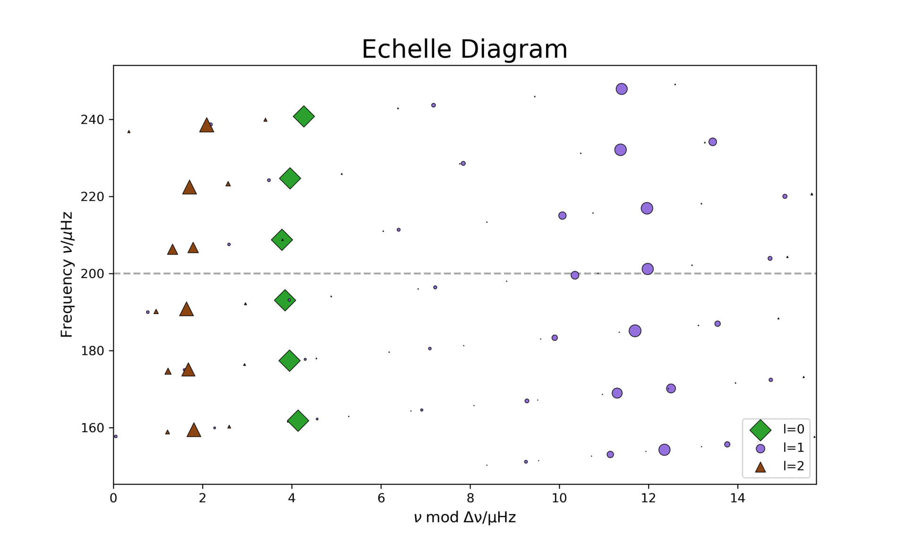

# Lab 3: Rotational Splitting of Stellar Oscillation Modes

In this lab, you will explore how **rotation** affects the frequencies of stellar oscillation modes. You will compute mode frequencies for **rotating stellar models** using GYRE, visualize the results with **echelle diagrams**, and compare your findings to the rotational splitting you estimated in **Lab 1**.

---

## Learning Goals

- Understand how rotation lifts the m-degeneracy of non-radial modes.
- Visualize rotational mode splitting in an echelle diagram.
- Compare GYRE-computed frequency splittings with the Δω<sub>g</sub> (rotational splitting of g-modes) you measured in Lab 1.

---

## 1. Background: Why Rotation Splits Modes

In a non-rotating star, modes with the same radial order `n` and angular degree `l`, but different azimuthal order `m`, have the **same frequency** — they are *degenerate*. When the star rotates, this degeneracy is **broken**:

- **Prograde modes** (m < 0) shift to **higher frequencies**
- **Retrograde modes** (m > 0) shift to **lower frequencies**
- The splitting between adjacent m values is proportional to the star’s internal rotation rate

---

## 2. Choosing a Rotating Model

For this lab, you will continue to use the rotating stellar model that you made in Lab 1, with the `nu_max` value that you chose in [the google sheet](https://docs.google.com/spreadsheets/d/1pAcvlfqOga0JNZo3cjJeZaErVd4youLYHyAmAu3NmSE/edit?usp=sharing).

<!--
You may use any of the rotating models provided under:

```
Resources/Models/full_0.001_rotating_LOGS/
```

For example, you could choose:

```
profile10.data.GYRE
```

But feel free to select any model (e.g., profile8, profile12) — the key is that the model **includes rotation**, as it will be used to compute rotational splittings.
-->

---

## 3. Enabling Rotation in GYRE

Start by copying your `gyre.in` file from Lab 2 to a new file called `gyre_rot.in`.

In your `gyre_rot.in`, include the following blocks to enable rotation and compute non-zero `m` modes:

```fortran
&rot
  Omega_rot_source = 'MODEL'
  coriolis_method = 'TAR'
/

&osc
  alpha_grv = 0  ! Cowling approximation (required for TAR)
/

&mode
  l = 1
  m = -1
  tag = 'non-radial'
/
&mode
  l = 1
  m = 0
  tag = 'non-radial'
/
&mode
  l = 1
  m = 1
  tag = 'non-radial'
/
```

You can include additional `l` and `m` values as needed.

Make sure you also include a `&scan` block that pairs with `tag_list = 'non-radial'` and covers a suitable frequency range (e.g., 100–300 μHz).

---

## 4. Output Format

Before running GYRE, make sure to create a folder called lab3_details `mkdir -p lab3_details`, where your output files will be saved. 

Save the summary and detail files in human-readable format. For example:

```fortran
&ad_output
  summary_file = 'lab3_details/summary.txt'
  summary_file_format = 'TXT'
  freq_units = 'UHZ'
  summary_item_list = 'l,m,n_pg,n_p,n_g,freq,freq_units,E_norm,E_p,E_g'
  detail_template = 'lab3_details/detail.l%l.n%n.txt'
  detail_item_list = 'l,n_pg,omega,rho,x,xi_r,xi_h,c_1,As,V_2,Gamma_1'
  detail_file_format = 'TXT'
/
```

---

## 5. Echelle Diagram and Rotational Splitting

The animation below compares the echelle diagrams from **Lab 2 (no rotation)** and **Lab 3 (with rotation)**.  
Notice how the $l = 1$ ridge clearly splits in the rotating case:



Once your GYRE run is complete:

- Use the output to plot an **echelle diagram**
- You should see that the $\ell = 1$ ridge is now split into **three distinct components**, corresponding to $m = -1, 0, +1$
- This is **direct evidence** of rotational splitting

**Now compare the observed splitting in the diagram with the $\delta\Omega_g$ you measured in Lab 1**

For instance:
- For each value of $n_pg$, we may estimate the rotational splitting by either computing the difference between the $m =\pm1$ and $m = -1$ mode frequencies, or from half the difference between the $m = +1$ and $m=-1$ frequencies. Do these agree? How does this change as a function of the $m=0$ mode frequency?
- Check if this roughly matches the rotation rate implied by $\delta\Omega_g$ from the g-mode period spacing, using values computed from Lab 1.

### Note on $m = 0$ Mode Shifts

When using the Traditional Approximation of Rotation (TAR) along with the Cowling approximation, the *m* = 0 modes may show a slight frequency shift compared to the non-rotating case. This is not a splitting but rather a systematic offset introduced by the TAR treatment, particularly noticeable in high-order *g*-modes.

---

## 6. Deliverables

- Your `gyre.in` input file with rotation and $m \ne 0$ modes
- A plot of your echelle diagram, showing rotational splitting
- A short note comparing the observed splitting to your $\delta\Omega_g$ measurement from Lab 1

---

## The Big Picture

The JWKB estimators that we computed in Lab 1 are limiting values for pure p- and pure g-mode rotationa splittings. On the other hand, the mixed modes in red giants can be interpreted naturally as possessing some combination of g-like character (with g-modes confined to the core of the star), and p-like character (with p-modes propagating in the envelope of the star). Thus, we would anticipate the rotational splittings of a mixed mode to take some intermediate value between one and the other. Red giants also tend to have cores that rotate much more quickly than the envelopes. Thus, considered as a function of frequency, we would expect to see the rotational splittings to be *small* at frequencies similar to those of pure p-modes, and *large* for frequencies close to pure g-modes.

---

## Optional Exploration

Try changing the rotation source in GYRE:

```fortran
Omega_rot_source = 'UNIFORM'
```

This will enforce a constant rotation rate. How does this affect the splitting pattern?

---

## Tips

- Use the same frequency scan range as in Lab 2 for easier comparison (e.g., 100–300 μHz)
- Don’t forget to use enough frequency resolution (`n_freq = 1000`) in the `&scan` block

---

Let us know if you run into any trouble — and have fun seeing rotation in action!

## Lab 3 BONUS: Rotation Kernels

## Rotation Kernels and Rotational Splitting

In this section, we compute **rotation kernels** for selected dipole \( \ell = 1 \) modes and use them to estimate the rotational splitting \( \delta\omega \) and the Ledoux constant \( C \) (via \( \beta = 1 - C \)) assuming solid-body rotation.

### What Is a Rotation Kernel?

A rotation kernel \( K(r) \) describes how sensitive a given mode is to rotation at different depths inside the star. For small rotation rates, the first-order perturbation to the mode frequency is:

\[
\delta\omega = m \int_0^R K(r) \, \Omega(r) \, dr,
\]

where \( \Omega(r) \) is the rotation profile and \( m \) is the azimuthal order of the mode.

### Step-by-Step Instructions

1. **Load a model and detail files** for several selected modes using `pygyre`.
2. **Extract** eigenfunctions \( \xi_r(r) \), \( \xi_h(r) \), density \( \rho(r) \), and coordinate \( r \).
3. **Calculate mode inertia**:

\[
I = \int_0^R \rho r^2 \left( |\xi_r|^2 + \ell(\ell+1) |\xi_h|^2 \right) dr
\]

4. **Compute the rotation kernel \( K(r) \)**:

\[
K(r) = \rho r^2 \cdot \left[ 2m \cdot \left( |\xi_r|^2 + (\ell^2 + \ell - 1) |\xi_h|^2 - \Re(\xi_r^* \xi_h + \xi_h^* \xi_r) \right) \right]
\]

5. **Estimate**:

\[
\beta = \frac{1}{2I} \int_0^R K(r) \, dr, \quad \delta\omega = \frac{1}{2I} \int_0^R K(r) \, \Omega(r) \, dr
\]

6. **Interpret the result**:
   - High-order \( g \)-modes typically have \( \beta \ll 1 \), meaning they are more sensitive to core rotation.
   - \( p \)-modes tend to have \( \beta \sim 1 \), sensitive to envelope rotation.

### Example Output

```text
    n     β (1-C)    δω (μHz)
------------------------------
  -29  0.7242+0.0000j  2.5840+0.0000j
  -30  0.8121+0.0000j  1.7557+0.0000j
...
  -38  0.7199+0.0000j  2.6305+0.0000j
  -39  0.6895+0.0000j  3.0290+0.0000j
...
  -65  0.5325+0.0000j  4.6219+0.0000j
```

In this example, lower-order \( g \)-modes (e.g., \( n = -30 \)) exhibit smaller δω and larger β, while higher-order modes are more sensitive to the inner rotation rate.

### Coding Notes

- Place functions (e.g., for kernel and inertia computation) in `rotation.py`.
- Write a clean `main.py` to iterate over selected modes, compute quantities, and print results.
- You can optionally plot \( K(r) \) to visualize where a mode is sensitive to rotation.

### Full Solutions

A sample implementation of the integration to obtain rotational kernels and splittings can be found [here](lab3_solutions.zip).

```python
# main.py
from rotation import read_model, read_details, compute_splitting
import glob
import os

model_file = 'model.GYRE'
detail_dir = 'lab3_details'
detail_files = sorted(glob.glob(os.path.join(detail_dir, 'detail.l1.n*.txt')))

model = read_model(model_file)
ρ, r, Ω, ξrs, ξhs = read_details(model, detail_files)

print(f"{'n':>5} {'β (1-C)':>12} {'δω (μHz)':>12}")
print("-" * 30)

for fname, ξr, ξh in zip(detail_files, ξrs, ξhs):
    try:
        # Extract radial order n from filename
        n_str = os.path.basename(fname).split('.n')[-1].split('.txt')[0]
        n = int(n_str)

        β, δω = compute_splitting(Ω, ρ, r, ξr, ξh, l=1)
        print(f"{n:5d} {β:12.4f} {δω*1e6:12.4f}")
    except Exception as e:
        print(f"Failed on {fname}: {e}")
```
